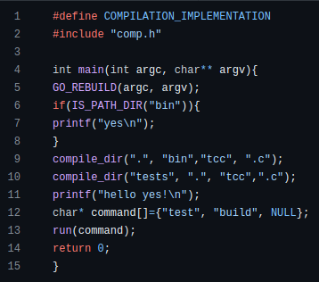
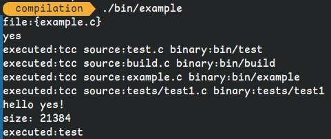

start date: 12/17/23

the name of this build tool is NoMake™. 
This build tool is simple and can be used to compile multiple directories, you can even call different compilers that look for a different extension in the same directory!
I will try to add recursion so that people can use this to compile all the files inside of a directory.

 to build this project you will need:

<ol><li>a c compiler a build recipe, there is one in examples/recipe.c and also one in /build.c </li> <li> the top of comp.h will show all the functions that are available, the lower part shows the implementation of these functions</li> <li>to use this project you will need a build recipe and to put `#define COMPILATION_IMPLEMENTATION` before you include the header comp.h, this will always be in comp.h and will also be in examples/recipe.c</li> </ol>

 this is a small build recipe, the recipe will rebuild itself using GO_REBUILD, then the first compile_dir command does this: it looks for files in the current directory or ".", then it will put the binary in "bin", it will use tcc as a compiler then and it will check for files with a ".c" extension to compile files

 there are examples in examples/ and getting_started/ 

this image is me using my library to compile a program and to then execute a file

