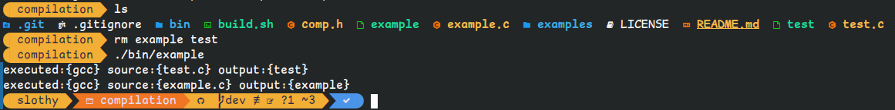

start date: 12/17/23
<ul>
<li>this project is for creating a build system that can look in a directory(s) and compile all file ending with a specific extension, the goal will be to add recursion and the ability to have mutliple 
extension that the program looks for and compiles as well as the ability to use different compilers for files with different extensions</li>
<li>you only need to compile your build recipe once, every other time you can just do ./recipe and it will recompile itself and then run itself but to do this you have to use rebuild_urself at the top of your program.</li>
</ul>
<<<<<<< HEAD
1. img 1.
=======
>>>>>>> a5694c3cc16908c6ced93f031e9cd1538e67de07

